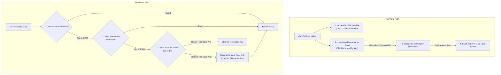

# Strata

[](https://github.com/geonna51/strata/actions/workflows/ci.yml)
[](https://en.wikipedia.org/wiki/C%2B%2B17)
[](LICENSE)
[]()

Strata is a fast, embedded Key-Value storage engine built from scratch in modern C++17 based on a **Log-Structured Merge (LSM) tree**. It is completely self-contained with **zero third-party dependencies**—just pure C++17 standard library and POSIX system calls.

---

## Why Strata? The Core Idea

Traditional databases use B-Trees, where updates write directly into disk pages in-place. On both spinning hard drives and modern SSDs, random in-place writes are slow, cause heavy write amplification, and wear out flash memory.

An LSM tree takes the opposite approach: **never do random writes to disk**.



1. **Writes are fast (~3 µs)**: Every `Put()` is appended to an on-disk Write-Ahead Log (WAL) and inserted into an in-memory SkipList (Memtable). No disk seeks.
2. **Reads check memory first, then disk**: `Get()` checks the newest in-memory data. If not found, it checks the SSTables on disk from youngest to oldest.
3. **Deletes write tombstones**: `Delete()` does not search disk to erase bytes. It writes a tombstone marker. The old data is cleaned up later during background compaction.
4. **Background compaction cleans up disk**: When too many files accumulate, a background thread merges overlapping sorted tables into deeper levels, purging duplicate keys and expired tombstones.

---

## The Hard Engineering Problems (and how we solved them)

Building a simple LSM tree is straightforward. Making it robust under concurrent reads, background compactions, and sudden power cuts is where systems engineering actually happens.

### 1. Compaction Deleting Files While Readers Are Reading Them
* **The Problem**: A background compaction thread merges four Level 0 SSTables into a new Level 1 SSTable, then unlinks (`rm`) the old files from disk. If an application thread is actively scanning an iterator or running a `Get()` on those exact files, how do you prevent segfaults and use-after-free crashes?
* **The Solution**: Strata uses version pinning with `std::shared_ptr<Version>`. When a reader starts a query or creates an iterator, it captures a shared pointer to the current database version. `SSTableReader` inherits from `std::enable_shared_from_this`, ensuring the reader and its open file descriptors stay alive.
* **Why POSIX makes this clean**: On POSIX filesystems (Linux and macOS), calling `unlink()` removes the filename from the directory, but the operating system **keeps the underlying inode and data blocks alive as long as an open file descriptor exists**. Readers continue reading from their open descriptors without interruption. Once the last iterator finishes and drops its reference, the kernel frees the file blocks.

### 2. Power Cuts and Phantom Directory Updates
* **The Problem**: In POSIX, `rename("CURRENT.tmp", "CURRENT")` updates the directory entry in the operating system's in-memory cache, but does **not** force that directory change to physical flash storage. If the machine loses power right after the rename, the directory entry can roll back, pointing to an old or non-existent manifest file.
* **The Solution**: Strata implements strict durability ordering via [`src/env.h`](file:///Users/georgen/Strata%20-%20Project/src/env.h):
  1. Write the new manifest pointer to `CURRENT.tmp` and call `fsync()`.
  2. Atomically `rename("CURRENT.tmp", "CURRENT")`.
  3. Open the database directory itself (`open(dirname, O_RDONLY)`) and call `fcntl(fd, F_FULLFSYNC)` on macOS or `fsync(fd)` on Linux.
  This guarantees directory metadata is physically committed to disk before returning to the caller.

### 3. Preventing Disk Seek Storms (Read Amplification)
* **The Problem**: In an LSM tree, a key could theoretically be located in any of dozens of SSTables on disk. If a client queries a non-existent key, checking 30 files would require 30 separate disk reads.
* **The Solution**:
  - **Bloom Filters**: Every SSTable contains a Bloom filter bitset (10 bits per key) generated using MurmurHash3. A fast in-memory bit check (~80 nanoseconds) rejects 99% of absent keys before touching the disk.
  - **LRU Block Cache**: Hot 4KB data blocks are kept in an in-memory concurrent LRU cache, so repeated lookups don't hit the filesystem.

### 4. Crash Recovery and Torn Writes
* **The Problem**: What happens if the power cuts in the middle of writing a 2KB record to the Write-Ahead Log? You end up with a half-written, corrupted record at the end of the file.
* **The Solution**: Every WAL frame starts with a 15-byte header containing record length, sequence number, record type, and an **IEEE 802.3 CRC32 checksum**. When Strata restarts, it validates every record from the beginning. When it hits the torn write at the end of the file, the CRC check fails, and Strata cleanly truncates the incomplete record. All previously acknowledged writes remain intact.

---

## On-Disk SSTable Binary Layout

SSTables are immutable files designed for sequential access, binary search, and zero unnecessary disk reads:

```
+-------------------------------------------------------------+
| Data Block 0 (4KB: Prefix-compressed keys, values, CRC32)  |
+-------------------------------------------------------------+
| Data Block 1 ...                                            |
+-------------------------------------------------------------+
| Data Block N                                                |
+-------------------------------------------------------------+
| Filter Block (MurmurHash3 Bloom filter bits, 10 bits/key)   |
+-------------------------------------------------------------+
| Index Block  (Separator keys -> Data Block Offset & Size)   |
+-------------------------------------------------------------+
| Footer (Fixed 48 Bytes: Metaindex Handle, Index Handle,     |
|         Zero Padding, Magic Number: 0xdb4772617461)         |
+-------------------------------------------------------------+
```

- **4KB Data Blocks**: Keys are prefix-compressed (`shared_len` + `non_shared_len`) to save space. Every 16 keys, a restart point stores the full key, allowing binary search inside the 4KB block without decompressing from the start.
- **Fixed 48-Byte Footer**: When opening an SSTable, Strata seeks directly to `file_size - 48` bytes with a single `pread()`. It verifies the magic number (`0xdb4772617461`, ASCII for `"Grata"`) and reads the index block handle, loading the index without reading the rest of the file.

---

## Real Benchmark Numbers

Measured on Apple Silicon (M2 Pro, 12 cores, macOS Darwin, Release build with `-O3` Clang) across 100,000 operations with 100-byte values:

| Benchmark | Throughput | Bandwidth | p50 Latency | p95 Latency | p99 Latency | Why it performs this way |
| :--- | :---: | :---: | :---: | :---: | :---: | :--- |
| **`readmissing`** | **7,021,999 ops/s** | 107 MB/s | **0.08 µs** | 0.08 µs | 0.08 µs | Bloom filter detects missing key in nanoseconds; zero disk I/O |
| **`readseq`** (Range scan) | **1,695,389 ops/s** | 184 MB/s | **0.59 µs** | 0.59 µs | 0.59 µs | Multi-way merge iterator streaming pre-sorted blocks |
| **`readrandom`** (Warm cache) | **1,113,525 ops/s** | 121 MB/s | **0.83 µs** | 1.25 µs | 1.58 µs | Served directly from 64MB in-memory LRU block cache |
| **`readcold`** (Disk reads) | **866,685 ops/s** | 94 MB/s | **0.67 µs** | 1.08 µs | 13.62 µs | Cache purged; reads index and data blocks directly from disk |
| **`fillrandom`** (Writes) | **134,213 ops/s** | 15 MB/s | **3.21 µs** | 4.50 µs | 7.71 µs | Writes append to WAL buffer and insert into SkipList in RAM |
| **`fillseq`** (Sequential) | **122,003 ops/s** | 13 MB/s | **3.12 µs** | 5.46 µs | 9.96 µs | Sequential WAL append and Memtable insert |
| **`fillsync`** (Physical sync) | **238 ops/s** | 0.03 MB/s | **4.05 ms** | 5.03 ms | 5.52 ms | Waits for physical NVMe storage sync (`F_FULLFSYNC`) on every write |

*Note on `fillsync`: 238 ops/sec is expected for synchronous physical disk flushing. An SSD or NVMe drive takes ~4 milliseconds to physically flush its volatile hardware write cache to non-volatile NAND.*

---

## Quick Start: Code Example

```cpp
#include <iostream>
#include <string>
#include "strata/db.h"

int main() {
  strata::Options options;
  options.create_if_missing = true;
  options.block_cache_capacity_bytes = 64 * 1024 * 1024; // 64MB LRU cache

  strata::DB* db = nullptr;
  strata::Status s = strata::DB::Open(options, "/tmp/strata_demo", &db);
  if (!s.ok()) {
    std::cerr << "Failed to open database: " << s.ToString() << std::endl;
    return 1;
  }

  // 1. Put a key-value pair
  s = db->Put("user:1001", "George");

  // 2. Get the value
  std::string value;
  s = db->Get("user:1001", &value);
  if (s.ok()) {
    std::cout << "user:1001 => " << value << std::endl;
  }

  // 3. Scan a key range with an Iterator
  std::unique_ptr<strata::Iterator> it(db->NewIterator());
  for (it->Seek("user:"); it->Valid() && it->Key().rfind("user:", 0) == 0; it->Next()) {
    std::cout << "Scan: " << it->Key() << " => " << it->Value() << std::endl;
  }

  // 4. Delete a key (writes a tombstone)
  db->Delete("user:1001");

  delete db;
  return 0;
}
```

---

## Testing & Verification

### 1. Concurrency Torture Test (`tests/concurrency_test.cc`)
Spawns **8 reader threads** (4 doing random point lookups, 4 doing continuous range scans) and **1 continuous writer thread** hammering a tiny 4KB memtable. This forces continuous minor flushes and major multi-level compactions during active concurrent reads.
- **Result**: Zero data races, zero assertion failures, zero read inconsistencies across 20,000+ operations.

### 2. Crash Recovery Torture Test (`tests/crash_test.py`)
Spawns an active writer process and issues sudden `SIGKILL` (`kill -9`) signals mid-write across multiple rounds. Upon restart, it verifies that:
1. Every write acknowledged to the user before the crash is recovered.
2. Torn uncommitted records at EOF are cleanly detected and truncated.
3. Zero data corruption occurs.

---

## How to Build and Run

### Prerequisites
- C++17 compiler (GCC 9+ or Clang 10+)
- CMake 3.15+
- Python 3 (for the crash test)

### Build Commands

```bash
# 1. Clone the repository
git clone https://github.com/geonna51/strata.git
cd strata

# 2. Configure and build Release binaries
cmake -B build -DCMAKE_BUILD_TYPE=Release
cmake --build build -j$(nproc 2>/dev/null || sysctl -n hw.ncpu)

# 3. Run all unit & integration tests
ctest --test-dir build --output-on-failure

# 4. Run the 8-reader concurrency torture test
./build/concurrency_test

# 5. Run the kill -9 crash recovery test
python3 tests/crash_test.py

# 6. Run the benchmark suite
./build/db_bench --num=100000 --value_size=100
```

---

## Project Structure

```
strata/
├── include/strata/          # Clean public interface
│   ├── db.h                 # DB::Open, Put, Get, Delete, NewIterator
│   ├── iterator.h           # Scan iterator (Seek, Next, Key, Value)
│   ├── options.h            # Configurable buffer size, cache size, sync mode
│   ├── slice.h              # Zero-copy string view wrapper
│   └── status.h             # Clean error status class (OK, NotFound, IOError)
├── src/                     # Core LSM-tree implementation
│   ├── skiplist.h           # Probabilistic lock-free reader SkipList
│   ├── memtable.h / .cc     # In-memory sorted memtable
│   ├── wal.h / .cc          # Append-only Write-Ahead Log with CRC32
│   ├── block.h / .cc        # 4KB block builder & reader with restart arrays
│   ├── bloom_filter.h / .cc # MurmurHash3 Bloom filter
│   ├── block_cache.h / .cc  # LRU block cache
│   ├── sstable_builder.cc   # SSTable binary file writer
│   ├── sstable_reader.cc    # SSTable reader & block decoder
│   ├── version_set.h / .cc  # MANIFEST logger & version tracking
│   ├── compaction.h / .cc   # Background multi-level compaction
│   ├── db_impl.h / .cc      # Main database coordinator
│   └── env.h                # POSIX directory sync & durable fsync helpers
├── benchmarks/
│   └── db_bench.cc          # Latency percentile & throughput benchmark suite
├── tests/
│   ├── concurrency_test.cc  # 8-reader + 1-writer concurrency torture test
│   ├── crash_writer.cc      # Subprocess for crash testing
│   ├── crash_test.py        # kill -9 recovery test runner
│   ├── db_test.cc           # Full end-to-end functionality tests
│   ├── memtable_test.cc     # SkipList & Memtable unit tests
│   ├── sstable_test.cc      # SSTable format & block unit tests
│   ├── version_set_test.cc  # Manifest recovery unit tests
│   └── wal_test.cc          # WAL append & corruption recovery tests
└── .github/workflows/
    └── ci.yml               # GitHub Actions CI (Linux GCC/Clang, macOS, ASan/TSan)
```

---

## License

MIT License. Open source and free for educational and commercial use.
